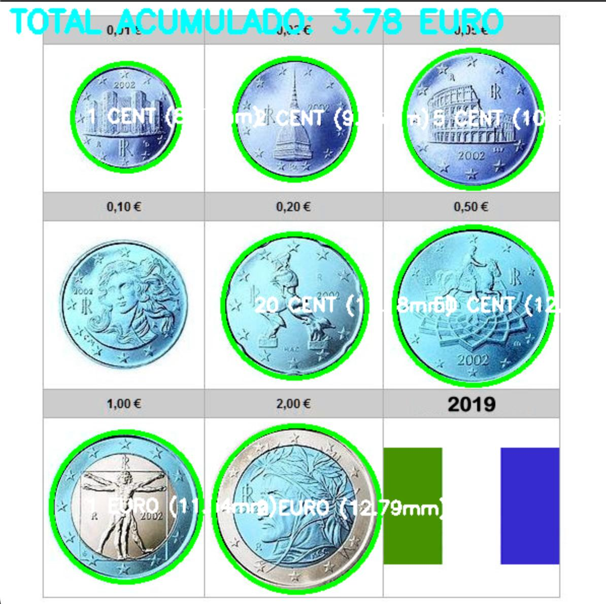
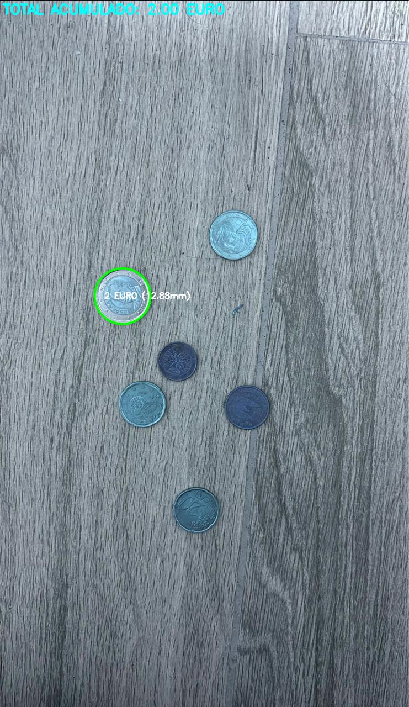
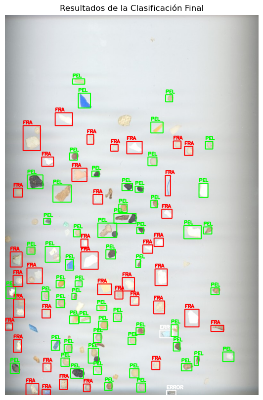
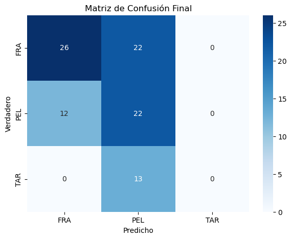

<!-- @import "design/style.css" -->
Autores: Francesco Faustino Greco - Bianca Cocci  
**GRUPO 05**

# **VISIÓN POR COMPUTADOR - PRÁCTICAS 3**

## Índice

- [Introducción](#introducción)
- [Identificación de monedas](#Identificación-de-monedas)
- [Características Geométricas](#características-geométricas)
- [Fuentes y Documentación](#fuentes-y-documentación)

---

## Introducción

El objetivo general de esta práctica es **aplicar técnicas de visión por computador** para analizar imágenes, segmentar objetos y extraer información relevante que permita su **clasificación automática**.

A lo largo de las diferentes tareas, se emplean herramientas de **procesamiento digital de imágenes** mediante la librería **OpenCV**, junto con el lenguaje **Python**, para desarrollar soluciones prácticas a problemas reales de identificación y clasificación visual.

Para realizar la práctica se deben realizar los siguientes preparativos:
```python
import cv2
import numpy as np
import pandas as pd
from pathlib import Path
import matplotlib.pyplot as plt
import seaborn as sns
from sklearn.preprocessing import StandardScaler
from sklearn.neighbors import KNeighborsClassifier
from sklearn.metrics import accuracy_score, confusion_matrix
```

---

## Identificación de monedas

En esta primera tarea, el objetivo fue **detectar e identificar monedas** en una imagen proporcionada.  
Para ello, se aplicaron distintas **técnicas de segmentación y procesamiento morfológico** que permitieron aislar las monedas del fondo y posteriormente calcular diferentes **propiedades geométricas y de color**.

Los pasos principales fueron los siguientes:

1. **Conversión a escala de grises** y **aplicación de desenfoque gaussiano** para reducir el ruido.
2. **Binarización** mediante un umbral adaptativo para separar las monedas del fondo.
3. **Aplicación de operaciones morfológicas** (como apertura y cierre) para eliminar pequeñas imperfecciones.
4. **Detección de contornos** con la función `cv2.findContours()` para obtener el perímetro y el área de cada moneda.
5. **Clasificación de monedas** según su tamaño o valor, utilizando el área y la relación de aspecto como características principales.

Finalmente, se representaron los resultados superponiendo los contornos detectados y mostrando las etiquetas de clasificación sobre la imagen original, verificando visualmente la correcta identificación de las monedas.

#### Detección y Preprocesamiento (Sección 2)

1. **Carga de Imagen:** Se carga el archivo de imagen especificado (`cv2.imread`).  
2. **Conversión a Escala de Grises:** La imagen se convierte a escala de grises.  
3. **Suavizado Gaussiano:** Se aplica un filtro Gaussiano (`cv2.GaussianBlur(..., (13, 13), 0)`) para reducir el ruido y mejorar la detección de bordes circulares.  
4. **Detección de Círculos:** Se utiliza la Transformada Circular de Hough (`cv2.HoughCircles`) con parámetros fijos (`HOUGH_PARAMS`) optimizados para la detección de monedas.


#### Calibración Global de Escala (Sección 3)

Dado que la cámara y la distancia focal varían, es esencial determinar la relación entre las dimensiones reales y los píxeles para clasificar las monedas con precisión.

1. **Estimación Inicial:** Se asume que el radio más grande en píxeles detectado (`max_r_pixel`) corresponde al radio real de la moneda de referencia.  
2. **Cálculo del Factor:** Para obtener el factor de conversión definitivo (`FACTOR_CONVERSION`), se calcula un promedio.  
   - Para cada moneda detectada, se calcula una relación dividiendo el radio ideal en milímetros de esa moneda (su valor estándar) por su radio medido en píxeles.  
3. **Factor de Conversión Definitivo:** El factor final se obtiene sumando todas las relaciones calculadas para cada moneda y dividiendo por el número total de monedas detectadas.  

**Explicación del Cálculo del Factor:**  
El **Factor de Conversión (mm/píxel)** se obtiene sumando las proporciones `(Radio Ideal en mm / Radio en Píxel)` para todas las monedas detectadas, y dividiendo esta suma por el número total de monedas. Es, esencialmente, un promedio de las proporciones mm/píxel encontradas.

#### Clasificación y Corrección de Ambigüedad (Sección 4)

1. **Radio Estimado en mm:** El radio en píxeles de cada moneda se multiplica por el `FACTOR_CONVERSION` para obtener su dimensión estimada en milímetros reales.  
2. **Clasificación por Mínimo Error:** La moneda se clasifica encontrando la moneda estándar cuyo radio en milímetros es más cercano al radio estimado.  
3. **Corrección:**  
   - Se aplica una corrección especial porque el **50 céntimos (€0.50)** y el **1 euro (€1.00)** tienen tamaños muy próximos.  
   - Se calcula un **Umbral Crítico**, el punto medio exacto entre ambos radios (aproximadamente intermedio).  

**Explicación de la Corrección:**  
Si el radio estimado de la moneda cae cerca del área gris (dentro de la tolerancia) entre 50 céntimos y 1 euro:

- Si el radio estimado ≥ Umbral Crítico → clasificar como **1€**.  
- Si el radio estimado < Umbral Crítico → clasificar como **50¢**.

#### Resultados de Pruebas y Análisis de Escenarios

El sistema fue evaluado con tres tipos de imágenes para probar la robustez del proceso completo, desde la detección hasta la calibración.

#### Escenario Ideal (Imagen Escala) y Escenario Ideal (Imagen No a Escala)

- **Imágenes Utilizadas:** `Monedas.jpg` (ideal, en escala) y `monete.jpg` (ideal, no a escala).  
- **Resultado:** En ambos casos, el rendimiento fue óptimo.  
- **Análisis:**  
  - La Transformada de Hough funcionó perfectamente debido a la alta calidad y contraste.  
  - La Calibración Global se ajustó correctamente en el segundo caso, demostrando que el cálculo promedio del factor de conversión es efectivo incluso cuando la escala inicial es desconocida.

<p align="center">
  
</p>

<p align="center">
  
</p>

#### Escenario Real (Fotografía Propia)

- **Imagen Utilizada:** `foto.jpeg` (fotografía tomada con móvil).  
- **Resultado:** El sistema solo detectó una moneda correctamente; las demás fueron ignoradas.  
- **Análisis de la Falla:**
  1. **Dificultades de Detección:**  
     - Las fotos reales introducen ruido, sombras, reflejos y distorsión de perspectiva, que hacen que los bordes circulares sean difusos o incompletos.  
     - Los parámetros fijos de Hough no son lo suficientemente flexibles para identificar contornos en estas condiciones.  
  2. **Impacto en Calibración:**  
     - Al detectar solo una moneda, el `FACTOR_CONVERSION` se basa únicamente en esa medición.  
     - La falla proviene de la localización, ya que la transformada de Hough no logró encontrar las otras monedas.

<p align="center">
  
</p>


---

## Características Geométricas

En esta tarea, el objetivo consiste en **extraer características geométricas y/o visuales** de las imágenes proporcionadas, con el fin de **aprender patrones que permitan identificar partículas** en nuevas imágenes.

Para la fase de prueba, se proporciona la imagen **`MPs_test.jpg`** junto con las anotaciones **`MPs_test_bbs.csv`**, que se utilizan para evaluar el rendimiento del modelo mediante el cálculo de métricas y la generación de la **matriz de confusión**.  
Esta matriz permite visualizar, para cada clase, el número de muestras correctamente clasificadas y aquellas clasificadas erróneamente como pertenecientes a otra categoría.

En el trabajo **SMACC: A System for Microplastics Automatic Counting and Classification**, se emplearon las siguientes **características geométricas**:

- **Área en píxeles**
- **Perímetro en píxeles**
- **Compacidad**, definida como la relación entre el cuadrado del perímetro y el área de la partícula.
- **Relación del área de la partícula con respecto al área del contenedor.**
- **Relación entre el ancho y el alto del contenedor.**
- **Relación entre los ejes mayor y menor de la elipse ajustada a la partícula.**
- **Relación entre las distancias mínima y máxima del centroide al contorno.**

Estas características permiten describir cuantitativamente la forma y proporciones de las partículas, facilitando su posterior **clasificación automática**.  
Una vez obtenidas las características, se entrenó un modelo de clasificación (por ejemplo, *k-NN*, *SVM* o *Random Forest*), evaluando su desempeño sobre los datos de test y generando la correspondiente **matriz de confusión**, donde se observó el número de aciertos y errores por clase.

#### Carga de imágenes y anotaciones
- Se leen las imágenes de entrenamiento y la imagen de prueba **`MPs_test.jpg`**.  
- Se cargan las anotaciones de las partículas (*bounding boxes*) desde el archivo **`MPs_test_bbs.csv`**, el cual indica la posición y la clase de cada partícula.

```python
Estoy creando más imágenes para el entrenamiento (volteadas)...
Imágenes de entrenamiento listas.
```

#### Preprocesamiento de imágenes
1. **Conversión a escala de grises** mediante `cv2.cvtColor`.  
2. **Filtrado con desenfoque gaussiano** para reducir el ruido.  
3. **Binarización** aplicando un umbral adaptativo o el método de **Otsu**.  
4. **Operaciones morfológicas** (apertura y cierre) para limpiar el fondo y separar correctamente las partículas.
Estas características se normalizan mediante `StandardScaler` para mejorar el rendimiento del modelo.


####  Entrenamiento del clasificador
- Se utiliza un modelo **K-Nearest Neighbors (KNN)** (`sklearn.neighbors.KNeighborsClassifier`) entrenado con las características de las partículas conocidas.  
- El número de vecinos (*k*) se selecciona de forma experimental para **maximizar la precisión** del modelo.

```python
for img_path in sorted(output_dir.glob("*.png")):
    label = img_path.name.split('_')[0]  # El nombre antes del guion bajo es la etiqueta
    image = cv2.imread(str(img_path))
    features = extract_geometric_features(image)
    if features:
        X_train.append(list(features.values()))
        y_train.append(label)
```

#### Evaluación del modelo
- Se predicen las clases de las partículas en la imagen de prueba.  
- Se calcula la **precisión global (accuracy)** mediante `accuracy_score`.  
- Se genera la **matriz de confusión** (`confusion_matrix`) para visualizar los aciertos y errores por clase.


#### Visualización de resultados
- Se dibujan los **contornos** y las **etiquetas de clase** sobre la imagen original.  
- Se muestran las **métricas de rendimiento** y la **matriz de confusión** utilizando `matplotlib` y `seaborn`.

<p align="center">
  
  
</p>

## Fuentes y Documentación

- [Documentación oficial de OpenCV](https://docs.opencv.org/)  
- **ChatGPT** – Asistencia para redacción técnica y explicación de código
- **Google Translate** – Asistencia lingüística
